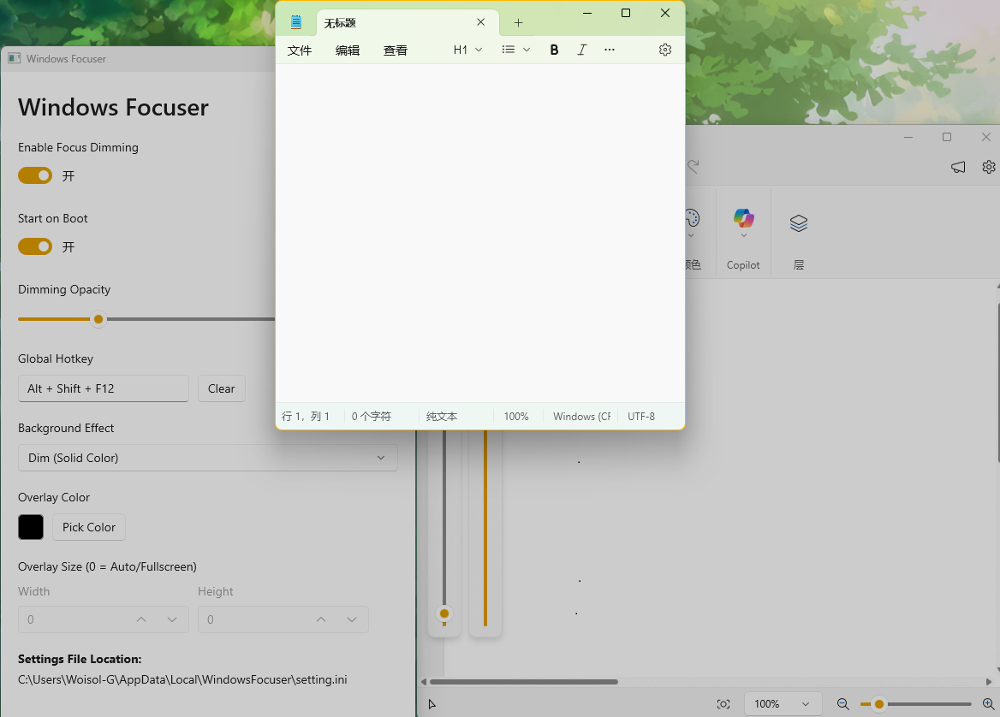

# WindowsFocuser

## Intro

 Windows Focuser

只是一个简单的在 Windows 系统下实现类 Linux 窗口聚焦的工具，让除了当前聚焦窗口外的其它窗口变暗，更聚焦于当前窗口。

效果参考：

项目灵感来源于[FocusWindowX](https://github.com/miaomiaosoft/FocusWindowX)，但使用 WinUI3 重新编写并优化了多屏场景的使用。

## 使用

1. Release 界面直接下载
2. 下载源码编译
